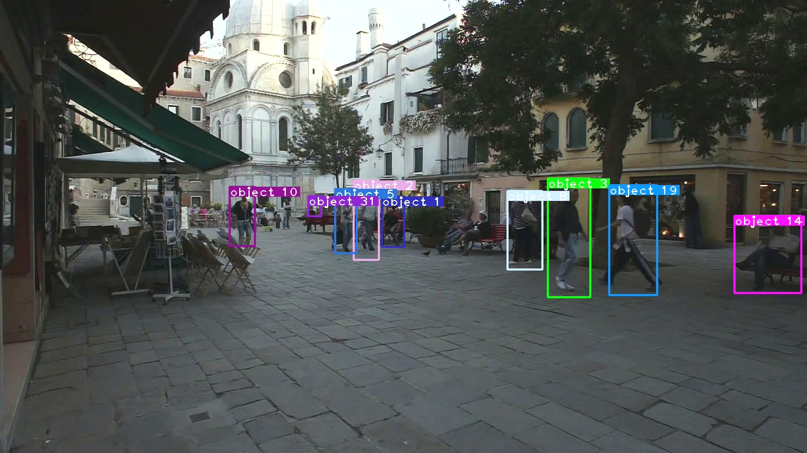
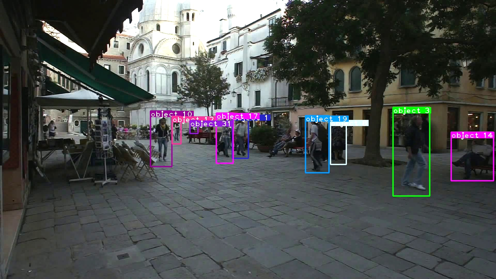

# Deep Sort with PyTorch (Adapted)

This directory contains an adapted version of [ZQPei/deep_sort_pytorch](https://github.com/ZQPei/deep_sort_pytorch), licensed under the MIT License.

**Note:** We moved `requirements.txt` to the root directory and adapted it to work **only** for training and tracking. Built-in detectors do **not** work in this project with the given requirements.

## What We’ve Changed

| File/Module                      | Description of Change |
|----------------------------------|------------------------|
| `deep_sort/deep/train.py` | Use model_name instead of args.model_name as a parameter for draw_curve() to prevent syntax error. |
| `deep_sort/deep/train.py` | Save training plots in the train_graphics folder. |
| `deep_sort/deep/train.py` | Use RandomResizedCrop instead of RandomCrop when transforming images for training. |
| `deep_sort/deep/train.py` | New Argument: Enable choice of optimizer between SGD (original optimizer, default), SGD + Nesterov and Adam. |
| `deep_sort/deep/train.py` | After training, print training loss, training accuracy, validation loss and validation accuracy per epoch. |
| `deep_sort/deep/train.py` | Change path for saving each model per epoch under given project structure. |
| `deep_sort/deep/train.py` | Declare model name from arguments before passing it to draw_curve to prevent syntax error. |
| `deep_sort/deep/train.py` | Change default of weights from './checkpoint/resnet18.pth' to None since they are pre-trained for pedestrians. |
| `deep_sort/deep/train.py` | New Argument: Add custom name for train.jpg to avoid overwriting when running for multiple hyperparameter values. |
| `deep_sort/deep/model.py` | Change number of classes to 3376 (matches with custom trained appearance model) and activate ReID. |
| `deep_sort/deep/multi_train_utils/train_eval_utils.py` | Does not print out the entire iteration progress when training the appearance model. |
| `deep_sort_pytorch/utils/log.py` | Create new function get_logger_to_file, similar to get_logger, but it moves logging of tracker numbers to a txt file instead of spamming the console on the notebook. |
| `deepsort.py` | Add a command that prevents an error with libiomp5md.dll. |
| `deepsort.py` | Remove unneeded imports and add missing imports after changes made on the tracker. |
| `deepsort.py` | Remove unneeded path for FastReID; custom trained appearance model used. |
| `deepsort.py` | Use get_logger_to_file to move the per-frame logs to a txt file to prevent spammig the console in the notebook. |
| `deepsort.py` | Adapt the tracker to handle frames as images (jpg, jpeg or png) instead of videos or camera input. |
| `deepsort.py` | Remove unneeded display settings and box drawing altogether; visualization will be done manually via `cell_tracking.ipynb`. |
| `deepsort.py` | Add loading the annotations file during initialization of the tracker. |
| `deepsort.py` | Before running the tracker, group all annotations by their image ID, all images by their ID and all image IDs by their file name to find all of them more faster. |
| `deepsort.py` | Remove building a redundant detector; detector replaced by detections from annotations file. |
| `deepsort.py` | Remove class names from non-existent detector. |
| `deepsort.py` | Remove loading `coco_classes.json` that do not represent any cells. |
| `deepsort.py` | Remove the part of code that does the detection with a selected detector; not needed as detections already exist. |
| `deepsort.py` | Instead of running a detector, get detections from the annotations file and feed them into the tracker of DeepSORT. |
| `deepsort.py` | Do not write the tracking results frame by frame, but all at once after the tracking is finished. |
| `deepsort.py` | Remove saving videos since this tracker only handles images as frames. |
| `deepsort.py` | Change default of video path from 'demo.avi' to 'dataset_jpg/dataset'. |
| `deepsort.py` | Remove config files as arguments; detection done via YOLOv5, appearance model added manually as an argument. |
| `deepsort.py` | Remove fastreid, mmdet and segment as arguments; prevents using the wrong appearance model and doing redundant detections of cells. |
| `deepsort.py` | New Argument: Add appearance model as an argument instead of as a YAML file; allows direct value manipulation through `cell_tracking.ipynb`. |
| `deepsort.py` | New Argument: Add test_folders as an argument to enable doing tracking on multiple folders. |
| `deepsort.py` | New Argument: Add annotations file as an argument that replaces the detector. |
| `deepsort.py` | Remove arguments for display, display width and display height; causes error otherwise and will be done for specific frames in `cell_tracking.ipynb` instead. |
| `deepsort.py` | Remove argument for camera; only images as frames are used here. |
| `deepsort.py` | New Arguments: Add tracking parameters of `deep_sort.yaml` as arguments; allows direct value manipulation through `cell_tracking.ipynb`. Defaults equal the given values from the original `deep_sort.yaml` file. |
| `deepsort.py` | Remove loading YAML files since they are not used now. |
| `deepsort.py` | Create a config class that replaces any YAML files and handles any parameters directly. |
| `deepsort.py` | Within the config class, set fastreid, segment and mmdet to False; prevents using the wrong appearance model doing redundant detections of cells. |
| `deepsort.py` | Within the config class, create a config container object for DeepSORT to enable assigning the values to the tracking parameters. |
| `deepsort.py` | Within the config class, set all tracking parameters (originally from `deep_sort.yaml`) and the cell-trained appearance model to the given values from the arguments. |
| `deepsort.py` | Run the VideoTracker of DeepSORT for all assigned test folders instead of for just one folder. |

Each adaptation was made during June / July 2025 by **Maximilian Karhausen** and **Johannes Simon**, and the code remains under the MIT License.

## Original README

*Below is the content from the original `deep_sort_pytorch/README.md`. Everything above this line reflects project-specific adaptations.*

---


## Update(1-1-2020)
Changes
- fix bugs
- refactor code
- accerate detection by adding nms on gpu

## Update(07-22)
Changes
- bug fix (Thanks @JieChen91 and @yingsen1 for bug reporting).  
- using batch for feature extracting for each frame, which lead to a small speed up.  
- code improvement.

Futher improvement direction  
- Train detector on specific dataset rather than the official one.
- Retrain REID model on pedestrain dataset for better performance.
- Replace YOLOv3 detector with advanced ones.

## Update(23-05-2024)

### tracking 

- Added resnet network to the appearance feature extraction network in the deep folder

- Fixed the NMS bug in the `preprocessing.py` and also fixed covariance calculation bug in the `kalmen_filter.py` in the sort folder

### detecting

- Added YOLOv5 detector, aligned interface, and added YOLOv5 related yaml configuration files. Codes references this repo: [YOLOv5-v6.1](https://github.com/ultralytics/yolov5/tree/v6.1).

- The `train.py`, `val.py` and `detect.py` in the original YOLOv5 were deleted. This repo only need **yolov5x.pt**.

### deepsort

- Added tracking target category, which can display both category and tracking ID simultaneously.

## Update(28-05-2024)

### segmentation

* Added Mask RCNN instance segmentation model. Codes references this repo: [mask_rcnn](https://github.com/WZMIAOMIAO/deep-learning-for-image-processing/tree/master/pytorch_object_detection/mask_rcnn). Visual result saved in `demo/demo2.gif`.
* Similar to YOLOv5, `train.py`, `validation.py` and `predict.py` were deleted. This repo only need **maskrcnn_resnet50_fpn_coco.pth**.

### deepsort

- Added tracking target mask, which can display both category, tracking ID and target mask simultaneously.

## latest Update(09-06-2024)

### feature extraction network

* Using `nn.parallel.DistributedDataParallel` in PyTorch to support multiple GPUs training.
* Added [GETTING_STARTED.md](deep_sort/deep/GETTING_STARTED.md) for better using `train.py` and `train_multiGPU.py`.

Updated `README.md` for previously updated content(#Update(23-05-2024) and #Update(28-05-2024)).

**Any contributions to this repository is welcome!**


## Introduction
This is an implement of MOT tracking algorithm deep sort. Deep sort is basicly the same with sort but added a CNN model to extract features in image of human part bounded by a detector. This CNN model is indeed a RE-ID model and the detector used in [PAPER](https://arxiv.org/abs/1703.07402) is FasterRCNN , and the original source code is [HERE](https://github.com/nwojke/deep_sort).  
However in original code, the CNN model is implemented with tensorflow, which I'm not familier with. SO I re-implemented the CNN feature extraction model with PyTorch, and changed the CNN model a little bit. Also, I use **YOLOv3** to generate bboxes instead of FasterRCNN.

## Dependencies
- python 3 **(python2 not sure)**
- numpy
- scipy
- opencv-python
- sklearn
- torch >= 1.9
- torchvision >= 0.13
- pillow
- vizer
- edict
- matplotlib
- pycocotools
- tqdm

## Quick Start
0. Check all dependencies installed
```bash
pip install -r requirements.txt
```
for user in china, you can specify pypi source to accelerate install like:
```bash
pip install -r requirements.txt -i https://pypi.tuna.tsinghua.edu.cn/simple
```

1. Clone this repository
```bash
git clone git@github.com:ZQPei/deep_sort_pytorch.git
```

2. Download detector parameters
```bash
# if you use YOLOv3 as detector in this repo
cd detector/YOLOv3/weight/
wget https://pjreddie.com/media/files/yolov3.weights
wget https://pjreddie.com/media/files/yolov3-tiny.weights
cd ../../../

# if you use YOLOv5 as detector in this repo
cd detector/YOLOv5
wget https://github.com/ultralytics/yolov5/releases/download/v6.1/yolov5s.pt
or 
wget https://github.com/ultralytics/yolov5/releases/download/v6.1/yolov5m.pt
cd ../../

# if you use Mask RCNN as detector in this repo
cd detector/Mask_RCNN/save_weights
wget https://download.pytorch.org/models/maskrcnn_resnet50_fpn_coco-bf2d0c1e.pth
cd ../../../
```

3. Download deepsort feature extraction networks weight
```bash
# if you use original model in PAPER
cd deep_sort/deep/checkpoint
# download ckpt.t7 from
https://drive.google.com/drive/folders/1xhG0kRH1EX5B9_Iz8gQJb7UNnn_riXi6 to this folder
cd ../../../

# if you use resnet18 in this repo
cd deep_sort/deep/checkpoint
wget https://download.pytorch.org/models/resnet18-5c106cde.pth
cd ../../../
```

4. **(Optional)** Compile nms module if you use YOLOv3 as detetor in this repo
```bash
cd detector/YOLOv3/nms
sh build.sh
cd ../../..
```

Notice:
If compiling failed, the simplist way is to **Upgrade your pytorch >= 1.1 and torchvision >= 0.3" and you can avoid the troublesome compiling problems which are most likely caused by either `gcc version too low` or `libraries missing`.

5. **(Optional)** Prepare third party submodules

[fast-reid](https://github.com/JDAI-CV/fast-reid)

This library supports bagtricks, AGW and other mainstream ReID methods through providing an fast-reid adapter.

to prepare our bundled fast-reid, then follow instructions in its README to install it.

Please refer to `configs/fastreid.yaml` for a sample of using fast-reid. See [Model Zoo](https://github.com/JDAI-CV/fast-reid/blob/master/docs/MODEL_ZOO.md) for available methods and trained models.

[MMDetection](https://github.com/open-mmlab/mmdetection)

This library supports Faster R-CNN and other mainstream detection methods through providing an MMDetection adapter.

to prepare our bundled MMDetection, then follow instructions in its README to install it.

Please refer to `configs/mmdet.yaml` for a sample of using MMDetection. See [Model Zoo](https://github.com/open-mmlab/mmdetection/blob/master/docs/model_zoo.md) for available methods and trained models.

Run

```
git submodule update --init --recursive
```


6. Run demo
```bash
usage: deepsort.py [-h]
                   [--fastreid]
                   [--config_fastreid CONFIG_FASTREID]
                   [--mmdet]
                   [--config_mmdetection CONFIG_MMDETECTION]
                   [--config_detection CONFIG_DETECTION]
                   [--config_deepsort CONFIG_DEEPSORT] [--display]
                   [--frame_interval FRAME_INTERVAL]
                   [--display_width DISPLAY_WIDTH]
                   [--display_height DISPLAY_HEIGHT] [--save_path SAVE_PATH]
                   [--cpu] [--camera CAM]
                   VIDEO_PATH         

# yolov3 + deepsort
python deepsort.py [VIDEO_PATH] --config_detection ./configs/yolov3.yaml

# yolov3_tiny + deepsort
python deepsort.py [VIDEO_PATH] --config_detection ./configs/yolov3_tiny.yaml

# yolov3 + deepsort on webcam
python3 deepsort.py /dev/video0 --camera 0

# yolov3_tiny + deepsort on webcam
python3 deepsort.py /dev/video0 --config_detection ./configs/yolov3_tiny.yaml --camera 0

# yolov5s + deepsort
python deepsort.py [VIDEO_PATH] --config_detection ./configs/yolov5s.yaml

# yolov5m + deepsort
python deepsort.py [VIDEO_PATH] --config_detection ./configs/yolov5m.yaml

# mask_rcnn + deepsort
python deepsort.py [VIDEO_PATH] --config_detection ./configs/mask_rcnn.yaml --segment

# fast-reid + deepsort
python deepsort.py [VIDEO_PATH] --fastreid [--config_fastreid ./configs/fastreid.yaml]

# MMDetection + deepsort
python deepsort.py [VIDEO_PATH] --mmdet [--config_mmdetection ./configs/mmdet.yaml]
```
Use `--display` to enable display image per frame.  
Results will be saved to `./output/results.avi` and `./output/results.txt`.

All files above can also be accessed from BaiduDisk!  
linker：[BaiduDisk](https://pan.baidu.com/s/1YJ1iPpdFTlUyLFoonYvozg)
passwd：fbuw

## Training the RE-ID model
Check [GETTING_STARTED.md](deep_sort/deep/GETTING_STARTED.md) to start training progress using standard benchmark or **customized dataset**.

## Demo videos and images
[demo.avi](https://drive.google.com/drive/folders/1xhG0kRH1EX5B9_Iz8gQJb7UNnn_riXi6)
[demo2.avi](https://drive.google.com/drive/folders/1xhG0kRH1EX5B9_Iz8gQJb7UNnn_riXi6)





## References
- paper: [Simple Online and Realtime Tracking with a Deep Association Metric](https://arxiv.org/abs/1703.07402)
- code: [nwojke/deep_sort](https://github.com/nwojke/deep_sort)
- paper: [YOLOv3: An Incremental Improvement](https://pjreddie.com/media/files/papers/YOLOv3.pdf)
- code: [Joseph Redmon/yolov3](https://pjreddie.com/darknet/yolo/)
- paper: [Mask R-CNN](https://arxiv.org/pdf/1703.06870)
- code: [WZMIAOMIAO/Mask R-CNN](https://github.com/WZMIAOMIAO/deep-learning-for-image-processing/tree/master/pytorch_object_detection/mask_rcnn)
- paper: [YOLOv5](https://github.com/ultralytics/yolov5)
- code: [ultralytics/yolov5](https://github.com/ultralytics/yolov5/tree/v6.1)
